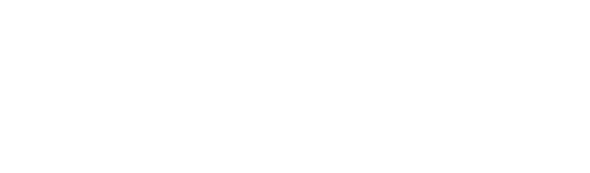
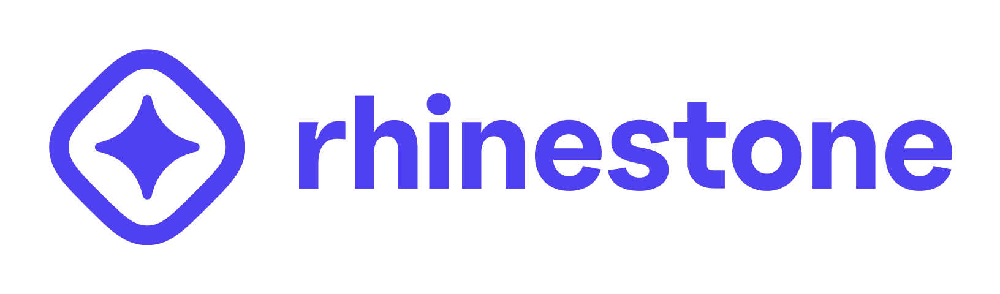

# Rhinestone Brand Assets

The official brand assets for any integrations, promotional or marketing materials.

## Guidelines

Don't combine the Rhinestone name or logos, or any portion of any of them, with any other logo, company name, mark, or generic terms, outside of pre-approved partnerships and collaborations. Please don't edit, modify, distort, rotate, or recolor the logo.

## Variations

| Type            | Location                                                   |
| --------------- | ---------------------------------------------------------- |
| Full logo - PNG | [/logo/full/png](/logo/full/png/)                          |
| Full logo - SVG | [/logo/full/svg](/logo/full/svg/)                          |
| Icon - PNG      | [/logo/icon/png](/logo/icon/png)                           |
| Icon - SVG      | [/logo/icon/svg](/logo/icon/svg)                           |
| PFP - PNG       | [/logo/icon/png/icon_pfp.png](/logo/icon/png/icon_pfp.png) |

### Examples

| Color              | Icon and name                                                     |
| ------------------ | ----------------------------------------------------------------- |
| Full logo, white   |   |
| Full logo, purple  |  |
| Full logo, black   |   |
| Icon, white        |   |
| Icon, purple       |  |
| Icon, black        |   |
| PFP, always purple |     |

---

## Shapes

Rhinestone's main color is a vibrant orange color on a dark blue color scheme. Since V2, Rhinestone follows a primarily dark theme (light theme coming soon). Please use the following colors accordingly.

| Color            | Icon and name                                                    |
| ---------------- | ---------------------------------------------------------------- |
| Full logo, white |  |

## Colors

Rhinestone's main color is a vibrant orange color on a dark blue color scheme. Since V2, Rhinestone follows a primarily dark theme (light theme coming soon). Please use the following colors accordingly.

| Color      | HEX                                                                                               | Notes              |
| ---------- | ------------------------------------------------------------------------------------------------- | ------------------ |
| purple.100 | `#EFEDFE`  |                    |
| purple.90  | `#CBC6FF`  |                    |
| purple.80  | `#A79EFF`  |                    |
| purple.70  | `#8479FF`  | Core color on dark |
| purple.60  | `#675AFA`  |                    |
| purple.50  | `#4F41EF`  | Core brand color   |
| purple.40  | `#3428D1`  |                    |
| purple.30  | `#2114AE`  |                    |
| purple.20  | `#140987`  |                    |
| purple.10  | `#0A0360`  |                    |
| purple.0   | `#05003B`  |                    |

## Typography

[Oatmeal](https://boulevardlab.com/Oatmeal-Sans) is our brand's typeface of choice. Oatmeal is a contemporary neo-grotesque typeface with subtle sharp contrasts with multiple alternatives. It works great set large on posters or headers, or small, as body text. Oatmeal’s combination of geometric forms with more quirky, characterful features matches Rhinestone’s brand values, which aim to cater to a technical audience while remaining approachable. Rhinestone’s logomark is set in Oatmeal-bold, but generally we’ll aim to use lighter weights, even for headings. The bold weight should not be used for any other text.

## Support

Questions? Text us on telegram or send us an email
